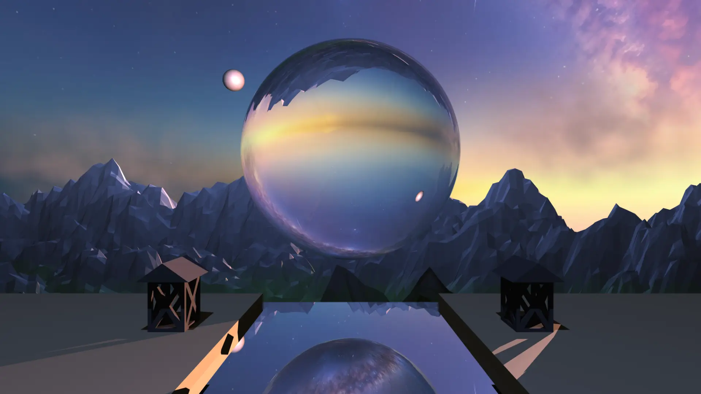

# Raytracing from Scratch
Implementation of a Raytracer as part of HSLU's Raytracing from scratch module.

Build in Rust, compiled to WASM, run in Angular.
Why? ¯\\\_(ツ)\_/¯ Why not.

# Final scene

[original](assets/result.png)

# How to start
Build the WASM module using `./build.sh`.
Start the Angular Server using `cd ui/; ng s -o`.

For the full image (see above) you need to add [/assets/skytexture.jpg](assets/skytexture.jpg) in the sidebar (⚙️) under "Skybox" and [/assets/Lantern.obj](assets/Lantern.obj) under "Objects" for both of them. Then press "Render".